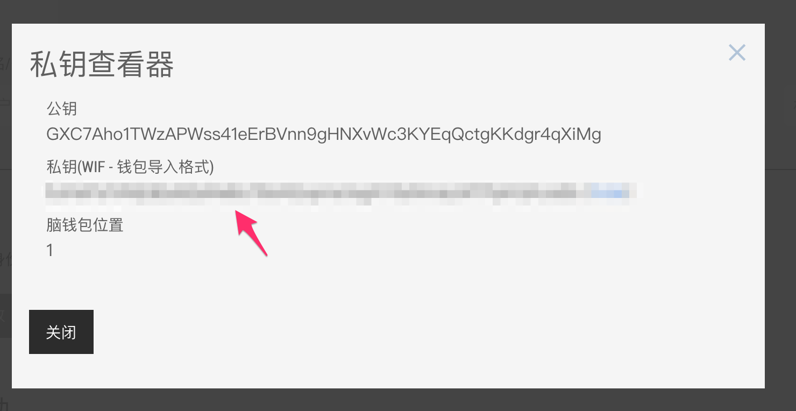
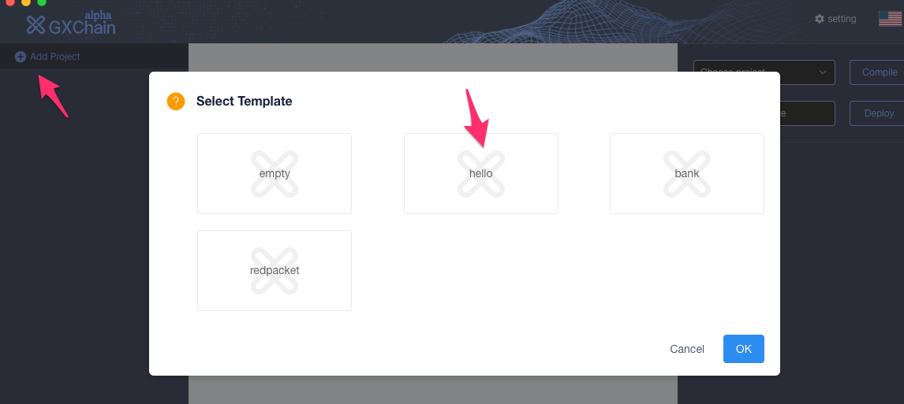
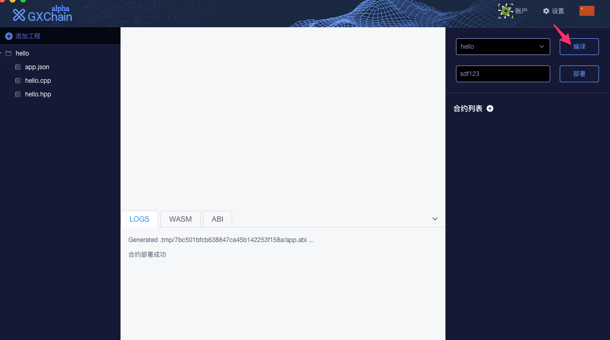
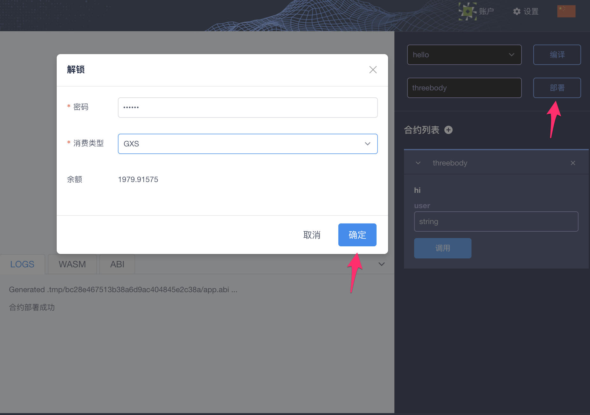
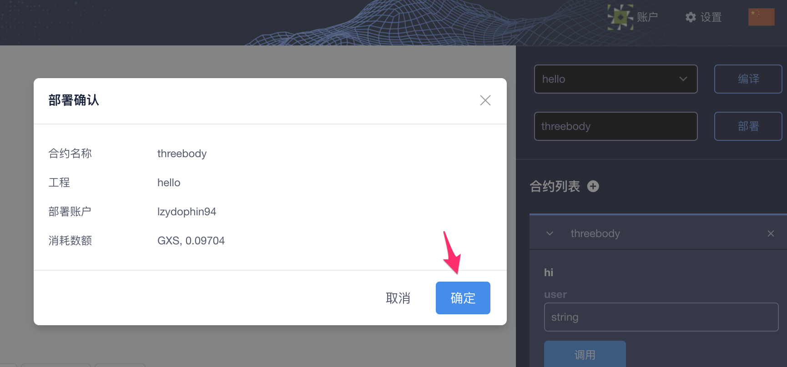
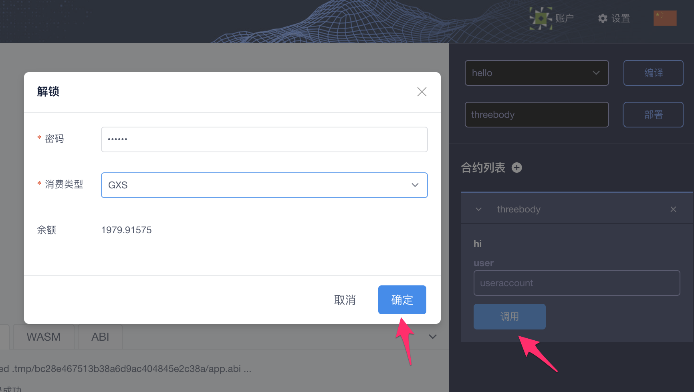
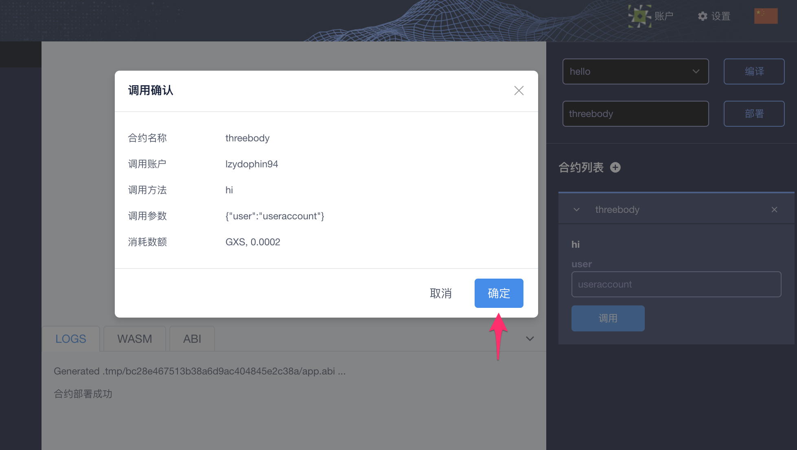

#  智能合约快速入门（testnet）

------------
### 一、智能合约介绍

GXChain智能合约2.0，底层使用WebAssembly虚拟机，目前支持C++语言的智能合约编写。
开发者使用C++编写智能合约，通过llvm将代码编译成WebAssembly（又名WASM），部署到区块链上，通过智能合约ABI(Application Binary Interface，应用程序的二进制接口)和智能合约交互。

##### 智能合约 API 参考文档
文档中列出了一些API和使用示例，可以在编写合约时调用：
https://github.com/gxchain/Technical-Documents/blob/master/gxb_contract_api.md

智能合约存储参考文档：https://github.com/gxchain/Technical-Documents/blob/master/contract/contract_storage_usage.md

##### 智能合约示例:
* helloworld合约： https://github.com/gxchain/gxb-core/tree/dev_master/contracts/examples/helloworld
* 充值提现合约： https://github.com/gxchain/gxb-core/tree/dev_master/contracts/examples/bank
* 红包合约： https://github.com/gxchain/gxb-core/tree/dev_master/contracts/examples/redpacket
* 线性释放资产合约：https://github.com/gxchain/gxb-core/tree/dev_master/contracts/examples/linear_vesting_asset
* 基于hash验证的猜谜合约：https://github.com/gxchain/gxb-core/tree/dev_master/contracts/examples/riddle


体验智能合约有两种方式： 使用智能合约IDE工具 和 使用cli_wallet
### 二、 快速开始 （通过智能合约IDE）
#### 1. 注册testnet钱包帐户

访问[testnet网页钱包](https://testnet.wallet.gxchain.org/#/)  ```https://testnet.wallet.gxchain.org/#/``` 注册钱包帐户。
注册完成后，点击[这里](http://blockcity.mikecrm.com/2SVDb67) 申领测试GXS。


#### 2. 下载智能合约IDE
通过智能合约IDE，可以编写、编译、部署、调用智能合约。
[IDE下载地址](https://github.com/gxchain/gxchain-alpha/releases)

#### 3.导入账户

先去步骤一中的testnet网页钱包找到自己的活跃权限私钥




再打开客户端，进入设置页面，导入账户(密码不会上传到服务器，如果忘记需要移除账户重新导入)：


#### 4.选择模板工程



#### 5. 编译



#### 6.部署

部署之前需要先解锁钱包





#### 7.调用

与部署一样，也需要先解锁钱包






### 三、快速开始 (使用本地命令行方式)

#### 1. GXChain源码编译

如果不想使用智能合约IDE工具，可以本地编译GXChain程序，通过命令行方式编译、部署、调用智能合约。
GXChain源码编译，目前支持ubuntu系统和mac系统：

- Build on Ubuntu： https://github.com/gxchain/gxb-core/wiki/BUILD_UBUNTU
- Build on OS X： https://github.com/gxchain/gxb-core/wiki/BUILD_OS_X

#### 2. 编译合约
使用gxx的模板创建一个helloworld合约
```
gxx -n helloworld
```

#### 3. 编译合约，生成wast和abi
编译合约，生成wast和wasm文件

```
gxx -o helloworld/helloworld.wast helloworld/helloworld.cpp
```
生成abi文件

```
gxx -g helloworld/helloworld.abi helloworld/helloworld.cpp
```

#### 4. 部署合约
需要开启cli_wallet，连接本地节点或者远程testnet节点
```
./programs/cli_wallet/cli_wallet -swss://testnet.gxchain.org --chain-id c2af30ef9340ff81fd61654295e98a1ff04b23189748f86727d0b26b40bb0ff4
```

导入钱包私钥

```
# 如果是新钱包，需要设置一个解锁密码，此处为mylocalpassword

new >>> set_password mylocalpassword

# 解锁
locked >>> unlock mylocalpassword

# 导入钱包私钥
unlocked >>> import_key your_account_name your_private_key

# 部署合约, 指定合约名为helloworld，发起的钱包帐户为your_accoutn_name， 0和0分别为vm type和vm version，./helloworld为wast/abi文件所在路径， GXS表示手续费资产类型，true表示发起广播
unlocked >>> deploy_cont1ract helloworld your_account_name 0 0 ./helloworld GXS true
```

#### 5. 调用合约
部署合约成功后，可以使用get_account接口查询合约

```
unlocked >>> call_contract nathan helloworld null hi "{\"user\":\"zhuliting\"}" GXS true

```

### 其它参考：
#### 安装GXChain testnet网络全节点程序
如果不想使用testnet提供的接入点，也可以本地部署一个全节点。
安装GXChain testnet全节点安装方法：

```
# 下载testnet的genesis.json文件
wget http://gxb-package.oss-cn-hangzhou.aliyuncs.com/gxb-core/genesis/testnet-genesis.json -O genesis.json

# 下载程序包， ubuntu安装包
wget http://gxb-package.oss-cn-hangzhou.aliyuncs.com/gxb-core/gxb_ubuntu_1.0.180809.beta.tar.gz -O gxb_ubuntu_1.0.180809.beta.tar.gz
# 解压
tar zxvf gxb_ubuntu_1.0.180809.beta.tar.gz

# 启动witness_node, 同步testnet区块数据
./programs/witness_node/witness_node --data-dir=testnet_node --rpc-endpoint="0.0.0.0:28090" --p2p-endpoint="0.0.0.0:9999" --seed-nodes='["testnet.gxchain.org:6789"]' --genesis-json genesis.json &

# 启动完成后，可以观察./testnet_node/log/witness.log观察区块同步情况，区块同步过程中每10000个区块会打印一条日志，同步完成后，每3秒打印一条日志ß
```

testnet 安装文档 ：https://github.com/gxchain/Technical-Documents/blob/master/test%20net.md

testnet 区块浏览器：https://testnet.explorer.gxchain.org/#/

testnet 网页钱包：https://testnet.wallet.gxchain.org/

testnet 钱包接入点：wss://testnet.gxchain.org

[note] 测试智能合约时需要注意：

* 目前的存储表(Multi-Index table)不支持的类型：int128, int256, float, double。
